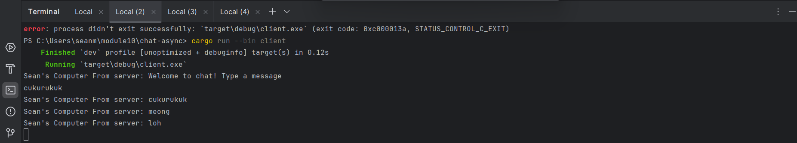
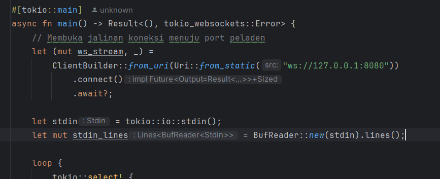
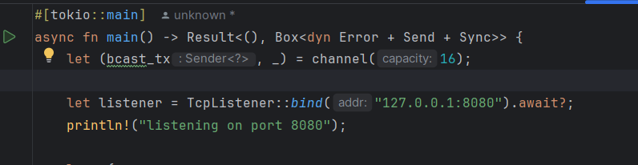
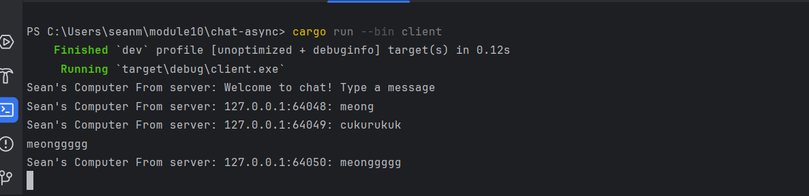

### “Experiment 2.1: Original code, and how it run”

Cara Menjalankan Aplikasi:
Untuk mengoperasikan aplikasi obrolan ini, langkah pertama yang harus dilakukan adalah menjalankan program peladen (server) melalui terminal utama dengan mengeksekusi perintah cargo run --bin server. Setelah peladen aktif mendengarkan koneksi jaringan pada port yang ditentukan, buka tiga buah jendela terminal baru secara terpisah untuk bertindak sebagai klien mandiri. Pada masing-masing terminal klien tersebut, jalankan perintah cargo run --bin client untuk menginisiasi proses jabat tangan protokol WebSocket menuju alamat peladen.

Analisis Alur Komunikasi Saat Mengetik Pesan:
Ketika seorang pengguna mengetikkan pesan teks di salah satu terminal klien dan menekan tombol enter, makro tokio::select! pada sisi klien akan langsung menangkap baris input tersebut melalui saluran standard input asinkronus dan mengirimkannya sebagai pesan teks WebSocket menuju peladen. Saat pesan tersebut bersandar di peladen, fungsi handle_connection akan mengekstrak isi teks dan menyalurkannya ke dalam saluran broadcast channel utama milik peladen. Saluran siaran ini secara otomatis akan menggandakan dan mendistribusikan pesan tersebut ke seluruh instansi receiver aktif yang terikat pada masing-masing koneksi klien lain. Akibatnya, setiap teks yang diketik oleh satu klien akan langsung muncul secara seketika (real-time) di layar terminal milik semua klien lainnya yang sedang terhubung, menunjukkan keberhasilan implementasi penanganan konkurensi asinkronus berbasis protokol WebSocket.

### “Experiment 2.2: Modifying port”.

#### CLient

#### Server

Proses pemindahan lokasi port jaringan dari nilai bawaan 2000 menjadi 8080 dilakukan dengan mengubah dua berkas kode sumber utama yang merepresentasikan dua sisi arsitektur jaringan, yaitu sisi peladen (server side) dan sisi klien (client side). Pada berkas peladen src/bin/server.rs, modifikasi diterapkan pada instansiasi TcpListener::bind dengan mengubah string alamat pengikatan jaringan dari "127.0.0.1:2000" menjadi "127.0.0.1:8080". Sementara itu, di sisi klien pada berkas src/bin/client.rs , perubahan dilakukan pada parameter fungsi statis ClientBuilder::from_uri(Uri::from_static(...)) dengan mengganti target alamat penargetan menjadi "ws://127.0.0.1:8080".  Komunikasi data interaktif ini sepenuhnya menggunakan skema protokol WebSocket yang sama. Protokol ini secara eksplisit didefinisikan melalui penggunaan skema penanda awal tautan berupa ws:// pada parameter URI di sisi klien. Penanda protokol tersebut berfungsi menginstruksikan pustaka klien agar melakukan inisiasi permintaan jabat tangan (handshake Upgrade request) dari protokol HTTP biasa menuju protokol WebSocket yang bersifat persisten dan dua arah (full-duplex). Di sisi lain, peladen juga telah dikonfigurasi menggunakan pustaka tokio_websockets untuk mendengarkan, memvalidasi, dan menerima jabat tangan protokol ws yang masuk tersebut melalui pemanggilan fungsi ServerBuilder::new().accept(socket), sehingga kedua belah pihak dapat saling bertukar data secara asinkronus tanpa hambatan pada port baru

### “Experiment 2.3: Small changes, add IP and Port”

Analisis Alasan dan Letak Perubahan Kode
Alasan utama dilakukannya perubahan ini adalah untuk meningkatkan fungsionalitas antarmuka aplikasi obrolan klien agar pesan yang diterima menjadi lebih informatif. Tanpa adanya modifikasi pada sisi peladen (server), setiap klien yang terhubung hanya akan menerima untaian teks mentah biasa tanpa mengetahui identitas fisik dari entitas pengirim pesan tersebut. Oleh karena sistem saat ini belum mengimplementasikan modul manajemen nama pengguna (username), pendekatan paling optimal untuk membedakan antar-klien adalah dengan memanfaatkan parameter informasi jaringan yang tersedia secara unik pada setiap soket koneksi aktif.

Perubahan kode dilakukan seluruhnya pada fungsi handle_connection di dalam berkas peladen src/bin/server.rs. Modifikasi diterapkan tepat di dalam blok pencarian asinkronus tokio::select! pada bagian penanganan pesan masuk (incoming message). Menggunakan makro format!, variabel addr yang menyimpan objek struktur SocketAddr pengirim (berisi kombinasi alamat IP dan nomor port) digabungkan di depan string pesan asli sebelum disalurkan ke saluran broadcast channel. Perubahan ini krusial karena peladen bertindak sebagai pusat kendali distribusi data; dengan memformat pesan di peladen, seluruh klien yang terhubung secara otomatis akan menerima pesan terformat yang sudah dilengkapi informasi pengirim tanpa perlu melakukan komputasi tambahan atau mengubah kode di sisi klien itu sendiri.